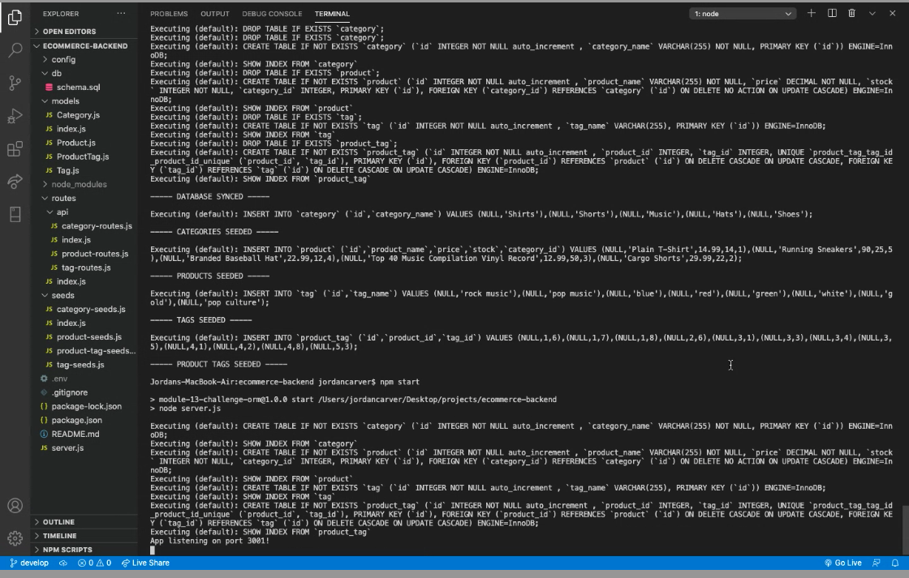
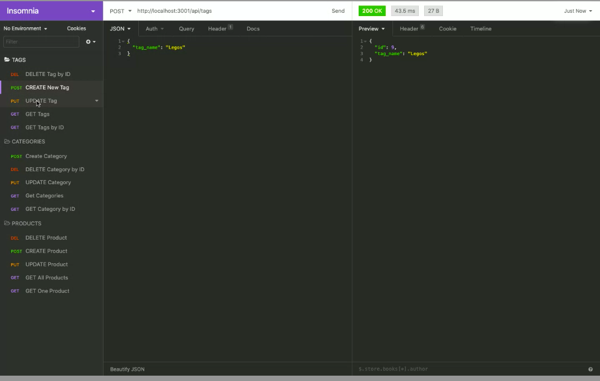

# E-Commerce Back End Website

## Description 

The app is a back end to an e-commerce website which enables an internet retail company to compete with its competition.

## Demo

[Link to the YouTube Demo](https://youtu.be/2sxloWQ4HFQ)

## Table of Contents
* [Installation](#installation)
* [Usage](#usage)
* [Credits](#credits)
* [License](#license)

## Installation
- git clone git@github.com:1jorcarver/ORM-eCommerce-BackEnd.git 
- npm install express sequelize mysql2 dotenv

## Usage
- Connect to MySQL in the terminal. 
- Use MySQL shell commands:
    - source db/schema.sql
    - use ecommerce_db
- Use NPM run seed
- Use NPM start
- Use Insomnia to run CRUD tests on PORT, localhost:3001

## Credits
- Trilogy, Module 13
- U of U Boot Camp & Course Recorded Class

## License

## Contributing
*Please note that this project is released with a Contributor Code of Conduct. By participating in this project you agree to abide by its terms.*

## Questions
* GitHub Username: 1jorcarver
* GitHub Profile: https://github.com/1jorcarver
* Email: jordan_carver@hotmail.com